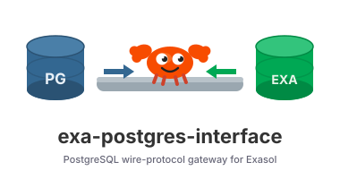

<div align="center">



# exa-postgres-interface

**A PostgreSQL wire-protocol gateway for Exasol.**

[](https://www.rust-lang.org/)
[](https://github.com/exasol-labs/exa-postgres-interface/releases)
[](./LICENSE)
[](./specs/)

</div>

https://github.com/exasol-labs/exa-postgres-interface/raw/main/demo/demo.mp4

> Don't see the video? [Watch the demo](demo/demo.mp4).

## What it solves

Several tools, BI platforms, or applications speak PostgreSQL but have no
native Exasol connector. `exa-postgres-interface` lets them connect to Exasol
**using an ordinary PostgreSQL driver** — no Exasol-specific client required.

PostgreSQL-capable clients connect to the gateway; the gateway translates their
SQL and metadata calls into Exasol's dialect and proxies the rest. Exasol
remains the database engine — it still owns SQL execution, storage, privileges,
and transaction semantics. The gateway only speaks the PostgreSQL wire protocol
on the client's behalf.

```
PostgreSQL client  ──Postgres wire──▶  exa-postgres-interface  ──Arrow/WebSocket──▶  Exasol
 (psql, JDBC, BI)                          (translation + proxy)                      (engine)
```

By default the gateway talks to Exasol through the
[`exarrow-rs`](https://github.com/exasol-labs/exarrow-rs) Apache Arrow driver;
set `exasol.transport = "websocket"` to use the WebSocket JSON protocol instead.

## Quick Start

> **Open port `15432`** on the host running the gateway (and any firewall or
> cloud security group in front of it) so PostgreSQL clients can connect.

### 1. Install

One-step install on Linux x86_64 — downloads the latest release, verifies its
SHA256, unpacks it, and launches an interactive bootstrap that writes the config
and installs the `PG_CATALOG`/`INFORMATION_SCHEMA` compatibility objects in
Exasol:

```bash
curl -fsSL https://github.com/exasol-labs/exa-postgres-interface/releases/latest/download/install.sh | sh
```

The bootstrap asks for the listener settings and your Exasol connection
details, then starts the gateway listening on `15432`.

> Manual tarball installs, the non-interactive catalog setup, the full
> configuration reference, and running as a **systemd** service are covered in
> the **[Installation guide](docs/installation.md)**.

### 2. Connect

Connect to the gateway using your PostgreSQL driver and your Exasol
credentials. Point it at the gateway host on port `15432`, database `exasol`,
with your Exasol username and password:

```bash
PGPASSWORD='EXASOL_PASSWORD' psql -h GATEWAY_HOST -p 15432 -U sys -d exasol -c 'SELECT 1;'
```

```text
jdbc:postgresql://GATEWAY_HOST:15432/exasol?preferQueryMode=extended
```

That's it — your PostgreSQL-speaking tool is now querying Exasol.

## Compatibility

The gateway targets common PostgreSQL client workflows: connectivity, catalog
browsing, JDBC metadata, read queries, core DML, selected DDL, gateway-managed
session commands (`search_path`, `SET application_name`, etc.), and basic
cursors. It does **not** claim full PostgreSQL server compatibility — SQL
execution, storage, privileges, and transaction semantics remain Exasol's.

Unsupported by design: `COPY`, `EXPLAIN`/`ANALYZE`/`VACUUM`, savepoints,
`LOCK TABLE`, extensions, publications, text-search objects, and other
PostgreSQL engine-specific features that lack an Exasol equivalent.

Clients exercised in the compatibility suite include `psql`, JDBC,
DBeaver, DbVisualizer, Qlik, and Metabase. Full details:

* [docs/compatibility-matrix.md](docs/compatibility-matrix.md)
* [docs/postgres-metadata-compatibility.md](docs/postgres-metadata-compatibility.md)
* [docs/client-compatibility-test-framework.md](docs/client-compatibility-test-framework.md)
* [docs/smoke-test.md](docs/smoke-test.md)

## Performance

The gateway adds modest, predictable overhead versus a direct Exasol JDBC
connection:

* **~140–155 ms** fixed cost per small query,
* **1.11–1.38×** direct-JDBC time on 1M–10M row transfers,
* **near-parity** once Exasol execution time dominates.

Re-benchmark in your own environment with
`scripts/run_gateway_vs_exasol_benchmark.sh` before treating any of these
numbers as acceptance criteria.

## Development

```bash
cargo fmt --check
cargo clippy --all-targets --all-features -- -D warnings
cargo test --all
cargo build --release
```

Live Exasol integration tests live under `tests/` and are marked `#[ignore]`
so they only run on demand. They expect the test instance defined in
`tests/common/mod.rs` (default `127.0.0.1:9564`, user `sys`). The instance
must already have `PG_CATALOG` and `INFORMATION_SCHEMA` installed — bootstrap
once with:

```bash
python3 scripts/exasol_exec.py \
  --dsn 127.0.0.1:9564 --user sys --password EXASOL_PASSWORD \
  --file sql/postgres_catalog_compatibility.sql
```

Then run the suite:

```bash
cargo test --all -- --ignored --test-threads=1
```

JDBC compatibility suite against a running gateway:

```bash
scripts/run_jdbc_compatibility_suite.sh \
  'jdbc:postgresql://127.0.0.1:15432/exasol?preferQueryMode=extended' \
  sys 'EXASOL_PASSWORD'
```

Releases are produced by [scripts/package_release.sh](scripts/package_release.sh)
and the GitHub Actions workflow that fires on `v*` tags. The script defaults
to `x86_64-unknown-linux-musl`; pass `TARGET_TRIPLE=x86_64-unknown-linux-gnu`
on hosts without the musl cross-toolchain.
